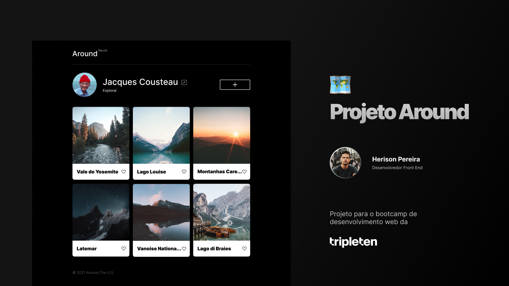

# Tripleten web_project_around

Bootcamp Desenvolvimento Web - TripleTen

- <a href="https://herisonp.github.io/web_project_around/" target="_blank">Veja o deploy</a>

## 👁 Preview

  

## 🚀 Tecnologias

Esse projeto foi desenvolvido com as seguintes tecnologias:

- HTML
- CSS
- Responsividade
- JavaScript
- POO (Programação orientada a Objeto)
- Webpack, Babel e PostCSS
- Git e GitHub
- Metodoliga BEM

## 💻 Projeto

Projeto criado durante o bootcamp de desenvolvimento web da TripleTen.

## 🧪 Melhorias

Algumas melhorias que podem ser aplicadas:

- Animação em alguns elementos da página para deixar mais dinâmico e interativo
- Salvar alterações do usuário no browser
